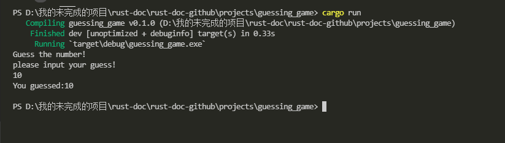

# 编写猜一猜游戏

让我们一起动手来编写一个 Rust 小程序吧！在这个小程序中，我们将学到`let`关键字,`match`关键字，方法，关联的函数，以及使用的依赖（crates），甚至更多知识点。这个小程序会自动生成 1~100 之间的正整数，然后由用户输入数字，程序将根据用户输入的数字来进行匹配，如果用户输入错误，则提示用户数字过大或者过小，直到用户猜对为止，然后就退出小程序。

## 创建一个新项目

接下来继续使用 cargo 工具在你的项目根目录创建一个新项目，命令如下:

```rust
$ cargo new guessing_game
$ cd guessing_game
```

第一行命令`cargo new`表示创建一个新的项目，项目名为`guessing_game`,第二行命令则是跳转到该目录下。

接下来，看一下`cargo.toml`文件:

```rust
[package]
name = "guessing_game"
version = "0.1.0"
authors = ["Your Name <you@example.com>"]
edition = "2018"

# See more keys and their definitions at https://doc.rust-lang.org/cargo/reference/manifest.html

[dependencies]
```

如果`cargo`默认生成的信息有些不符合你的要求，可根据需要来进行修改并保存。接下来让我们继续看着`main.rs`文件，`cargo`默认会创建一个函数，然后函数体里面就是打印`hello,world!`。代码如下:

```rust
fn main(){
    println!("hello,world!");
}
```

让我们尝试用`cargo run`命令来进行调试，同样的步骤如前面所述，如下:

```rust
$ cargo run
   Compiling guessing_game v0.1.0 (file:///projects/guessing_game)
    Finished dev [unoptimized + debuginfo] target(s) in 1.50s
     Running `target/debug/guessing_game`
Hello, world!
```

接下来才是我们的重头戏，让我们重写`main.rs`文件里的代码。

## 处理用户输入的数字

首先我们需要要求用户输入信息，并且处理输入的信息，然后检查用户输入的信息是否是我们所期待的正确答案。最开始，我们需要让用户输入猜测的数字，代码如下:

```rust
use std::io;
fn main(){
    println!("猜数字游戏现在开始!")
    println!("请输入正整数!");

    let mut guess = String::new();

    io::stdin().read_line(&mut guess).expected("程序出现问题!");

    println!("你猜测的数字是:{}",guess);
}
```

这些代码包含了太多的知识点了，让我们一行一行的来分析吧！首先，为了提示用户输入并且能够打印出结果作为输出，我们需要使用`io`(input/output,输入输出)库,`io`库来自`Rust`的一个标准库，这个标准库就被叫做`std(standard library)`。

```rust
use std::io;
```

默认情况下，`Rust`会将一些类型添加进程序的作用域中，即[the prelude](https://doc.rust-lang.org/std/prelude/index.html)（这个就是指 rust 默认会自动引入的一些依赖列表，也可被叫做默认依赖包）。如果需要使用的类型不在这个默认依赖包中，那么我们就需要使用`use`语句来显式的引入到作用域中。使用`std::io`库会有很多有用的功能，这其中也包括我们接下来要使用到的能够允许用户输入的能力。

正如前面所介绍到的，每个`Rust`程序的入口就是`main`函数。

```rust
fn main(){}
```

`fn`语法表示声明一个函数，括号`()`内可以添加参数，但在这里是没有参数的，而`{}`则代表函数的主体，我们将要编写的所有功能代码都在这个函数主体中。

`println`则可以算作是一个集合，就是将用户输入的信息打印在终端上。

```rust
println!("猜数字游戏现在开始!")
println!("请输入正整数!");
```

这两行代码无非就是提示用户这个小程序是做什么的。

### 用变量来存储值

接下来，我们将创建一个变量用来存储用户输入的信息，代码如下:

```rust
let mut guess = String::new();
```

这个小程序变得十分有趣了！这一行代码做了很多事情，注意`let`语句是用来创建一个变量的，我们来看另一个示例代码如下:

```rust
let foo = bar;
```

这一行代码创建了一个`foo`变量，并且将变量的值赋值为`bar`.`Rust`语言的变量默认是不可变(`immutable`)的,后续会讨论[变量的可变性](https://doc.rust-lang.org/book/ch03-01-variables-and-mutability.html#variables-and-mutability)。下面的例子展示了如果在变量之前使用`mut`关键字即可让变量可变(`mutable`)。

```rust
let foo = 50;//不可变
let mut bar = 100;//可变
```

> 注意：//语法就是注释语句，注释一直持续到行尾。Rust 忽略了注释中的所有内容，第 3 章将对此进行详细讨论。

现在我们也就知道了`let mut guess`无非就是定义一个可变的变量，变量名就叫做`guess`。而`=`右边的值就是该变量所赋的值，也就是`String::new`。这是一个函数，会返回一个`String`实例。[String](https://doc.rust-lang.org/std/string/struct.String.html)是标准库中的一种数据类型，被叫做字符串，也是`UTF-8`编码的文本类型。

`::new`中的`::`符号表示该类型关联一种函数，也就是`String`的关联函数。关联函数(在这里是`String`类型)是在类型上实现的，而不是在`String`的特定实例上实现的，在一些语言当中，也把它称作是静态方法。

`new`函数会创建一个新的空的字符串实例，你会发现在许多类型当中都会有`new`函数，因为它只是一个通用函数的名称而已，并且它会创建某种新的值。

总而言之，`let mut guess = String::new();`这一行代码就是创建一个可变的变量，并且这个变量的值是一个空的字符串实例。

回想一下在程序的第一行代码中，我们通过使用`use std::io;`语句来从标准库中获取到的有关用户输入输出的关联函数，现在我们从`io`模块中调用`stdin`函数。如下:

```rust
    io::stdin().read_line(&mut guess);
```

如果我们在程序的开头的代码中并没有写`use std::io;`，我们在这里调用这个函数的时候需要重写成`std::io::stdin`。`stdin`是一个返回类型为[std::io::stdin](https://doc.rust-lang.org/std/io/struct.Stdin.html)的实例，也就是一种类型，代表着为你的终端处理标准的输出。

下一部分代码,`.read_line(&mut guess)`,调用[read_line](https://doc.rust-lang.org/std/io/struct.Stdin.html#method.read_line)方法在标准输入中获取并处理用户的输入。我们也为`read_line`方法传递了一个参数:`&mut guess`。

`read_line`的工作就是将用户输入的任何内容带入标准输入库中，并放置到字符串中，所以它将该字符串作为参数。字符串参数必须是可变，因此可以通过添加用户的输入来更改字符串的内容。

`&`标识符代表参数是引用，它为我们提供了一种方式，也就是我们的代码的很多地方都可以访问到一条数据，也因此不需要做复制数据到内存中的操作。引用是一种复杂的特性，使用引用也比较安全和便捷，这也是`Rust`的主要优势之一。我们并不需要为了完成这个程序而了解引用的太多细节，现在我们需要知道的就像变量，引用默认是不可变的
因此我们需要写`&mut guess`而不是`&guess`来让变量可变。（第 4 章会解释引用的更多信息。）

### 使用返回的结果来处理潜在的故障

我们接着讨论一下第三行代码，也是属于这一部分的代码，它是一个方法:

```rust
 expect("调用read_line失败!");
```

当我们使用类似`.foo()`的格式来调用方法时，最明智的做法就是引入换行符或者是其它空格来将很长的一行代码进行分隔，因此我们需要重写如上的代码如下:

```rust
   io::stdin().read_line(&mut guess).expect("调用read_line失败!");
```

然而这样很长的一行是很难阅读的，所以最好要分割它。现在我们来讨论一下这一行都做了什么。

正如更早之前所提到的，`read_line`将用户键入的内容放入我们要传递的字符串中，但它还会返回一个值，在这种情况下为[io::Result](https://doc.rust-lang.org/std/io/type.Result.html)。`Rust`在它的标准库(一种通用的[Result](https://doc.rust-lang.org/std/result/enum.Result.html)也作为一个特殊的版本的子模块，就像`io::Result`)中有一种数值类型叫做`Result`。

`Result`是可以进行[枚举](https://doc.rust-lang.org/book/ch06-00-enums.html)操作的，通常也被作为枚举来提及。一个枚举值也是一个类型可以有许多被修复和设置的值，并且这些值通常也被叫做枚举的变体。第六章会详细介绍枚举。

> 变体，也可以把它理解为回调函数吧。

对于`Result`，通常变体就是`Ok`或者`Err`。`OK`变体表示这种操作是成功的，并且在`OK`里面会生成一个成功值。`Err`变体意味着这种操作失败了，并且`Err`也会包含一些关于这种操作如何或者是为什么失败的信息。

`Result`类型旨在对错误处理信息进行编码。`Result`类型的值就像任意类型的值，会有方法来定义它们。`io::Result`有一个你可以调用的`expect`方法。如果`io::Result`这个实例的值是`Err`,`expect`将会导致程序崩溃并且会显示你需要传递一个参数给`expect`的信息。如果`read_line`方法返回一个`Err`值，则可能是来自底层操作系统的一种错误结果。如果`io::Result`这个实例的值是`OK`，`expect`将会将`OK`保存的返回值返回给你，让你能够使用它。在这种情况下，这个值就是用户通过标准的输入框键入的数字字符。

如果你不调用`expect`方法，程序将会编译，并且你会得到一个警告:

```rust
$ cargo build
   Compiling guessing_game v0.1.0 (file:///projects/guessing_game)
warning: unused `std::result::Result` that must be used
  --> src/main.rs:10:5
   |
10 |     io::stdin().read_line(&mut guess);
   |     ^^^^^^^^^^^^^^^^^^^^^^^^^^^^^^^^^^
   |
   = note: `#[warn(unused_must_use)]` on by default
   = note: this `Result` may be an `Err` variant, which should be handled

warning: 1 warning emitted

    Finished dev [unoptimized + debuginfo] target(s) in 0.59s
```

rust 的警告说明你没有用`read_line`方法返回的`Result`值,也就是说程序并没有处理这个可能的错误。消除警告的办法就是编写实际的错误处理，但是由于你只是想在程序出现问题时崩溃，所以你可以使用`expect`方法。你将在第 9 章中学会如何处理错误。

### 使用 println!方法来在终端打印值，占位符

除了结束大括号之外，到目前为止在添加的代码中需要讨论的只有一行，那就是如下所示:

```rust
println!("You guessed:{}",guess);
```

这一行将会打印一个字符串，也就是我们保存了用户所输入的数字。一对大括号`{}`,是一种占位符，我们可以认为它就是一种固定值。你可以使用大括号打印多个值：第一组大括号包含在格式字符串之后列出的第一个值，第二组包含第二个值，依此类推。在一次调用 println! 中打印多个值！看起来像这样：

```rust
let x = 5;
let y = 10;
println!("x = {} and y = {}",x,y);
```

代码将会打印`x = 5 and y = 10`。

### 测试第一部分

让我们测试一下猜数字游戏的第一部分代码。通过使用`cargo run`来运行:

```rust
$ cargo run
   Compiling guessing_game v0.1.0 (file:///projects/guessing_game)
    Finished dev [unoptimized + debuginfo] target(s) in 6.44s
     Running `target/debug/guessing_game`
Guess the number!
Please input your guess.
6
You guessed: 6
```

如下图所示:



在此刻，游戏的第一部分已经生效:我们已经得到了从键盘输入的结果并且打印出了它。

### 生成一个隐秘的数字

下一步，我们将需要生成一个秘密的数字让用户去尝试猜一下。秘密的数字应该每次都是不同的，这样也就可以让用户可以玩很多次这个游戏。让我们使用 1 到 100 之间的随机数，这样游戏也没有那么难。rust 的标准库中也没有包含随机数函数。然而，rust 团队提供了一个[rand](https://crates.io/crates/rand)依赖箱。

### 使用一个依赖包是为了获取更多的功能

记住一个依赖包是一个 rust 源代码文件的集合。这个项目我们已经构建了一个二进制程序包，也是一个可执行文件。这个依赖包就是一个常规的包，包含在其他程序中使用的代码视图。

cargo 使用外部依赖包在这里就是真正的亮点。在编写使用依赖包的代码之前，我们需要修改 Cargo.toml 文件以包含依赖包作为依赖项。现在打开该文件，并将以下行代码添加到底部，位于 Cargo 为你创建的 [dependencies](依赖项)部分标题下方。请务必使用此版本号完全按照我们此处的方式指定依赖包，否则本教程中的代码示例可能无法正常工作：

文件名: Cargo.toml

```rust
[dependencies]
rand = "0.8.5"
```

在 Cargo.toml 文件中，[dependencies]后面的所有内容都是该部分的一部分，一直持续到另一个部分开始。在 [dependencies] 中，相当于是你告诉 Cargo 你的项目依赖哪些外部依赖包，以及你需要这些依赖包的哪些版本。在本例中，我们使用语义版本说明符 0.8.5 指定依赖包的版本。Cargo 知道控制[语义版本](http://semver.org/)（有时称为 SemVer），这是编写版本号的标准。说明符 0.8.5 实际上是 ^0.8.5 的简写，这意思就是任何版本至少是 0.8.5 以上，并且低于 0.9.0。

Cargo 认为这些版本具有与 0.8.5 版本兼容的公共 API，并且此规范确保你将获得仍将使用本章中的代码进行编译的最新补丁版本。不保证任何 0.9.0 或更高版本具有与以下示例使用的 API 相同的 API。

现在，在不更改任何代码的情况下，让我们构建项目，如列表 2-2 所示。

```rust
$ cargo build
    Updating crates.io index
  Downloaded rand v0.8.5
  Downloaded libc v0.2.127
  Downloaded getrandom v0.2.7
  Downloaded cfg-if v1.0.0
  Downloaded ppv-lite86 v0.2.16
  Downloaded rand_chacha v0.3.1
  Downloaded rand_core v0.6.3
   Compiling libc v0.2.127
   Compiling getrandom v0.2.7
   Compiling cfg-if v1.0.0
   Compiling ppv-lite86 v0.2.16
   Compiling rand_core v0.6.3
   Compiling rand_chacha v0.3.1
   Compiling rand v0.8.5
   Compiling guessing_game v0.1.0 (file:///projects/guessing_game)
    Finished dev [unoptimized + debuginfo] target(s) in 2.53s

```

列表 2-2: 将依赖包添加为依赖项后运行 Cargo build 的输出

你可能会看到不同的版本号（但由于 SemVer，它们都与代码兼容！）和不同的行（取决于操作系统），并且行的顺序可能不同。

当我们包含外部依赖项时，Cargo 会从注册表中获取依赖项所需的所有内容的最新版本，注册表是来自[Crates.io](https://crates.io/)的数据副本。Crates.io 是 Rust 生态系统中的人们发布他们的开源 Rust 项目供其他人使用的地方。

更新注册表后，Cargo 会检查 [dependencies] 部分并下载列出的尚未下载的任何包。在本例中，尽管我们仅将 rand 列为依赖项，但 Cargo 还获取了 rand 工作所依赖的其他包。下载包后，Rust 会编译它们，然后使用可用的依赖项编译项目。

如果你立即再次运行 cargo build 而不做任何更改，除了 Finished 行之外，你将不会得到任何输出。Cargo 知道它已经下载并编译了依赖项，并且你没有在 Cargo.toml 文件中对它们进行任何更改。Cargo 还知道你没有更改任何代码，因此它也不会重新编译它。由于无事可做，它只是退出。

如果你打开 src/main.rs 文件，进行微小的更改，然后保存并再次构建，你只会看到两行输出：

```rust
$ cargo build
   Compiling guessing_game v0.1.0 (file:///projects/guessing_game)
    Finished dev [unoptimized + debuginfo] target(s) in 2.53 secs
```

这些行表明 Cargo 只会根据你对 src/main.rs 文件的微小更改来更新构建。你的依赖项没有改变，因此 Cargo 知道它可以重用已为这些依赖项下载和编译的内容。

#### 使用 Cargo.lock 文件确保可重现构建

Cargo 有一种机制，可确保你或任何其他人每次构建代码时都可以重建相同的工件：Cargo 将仅使用你指定的依赖项版本，除非你另有说明。例如，假设下周 rand crate 的 0.8.6 版本发布，该版本包含一个重要的bug修复，但也包含一个会破坏你的代码的回归。为了处理这个问题，Rust 会在你第一次运行 cargo build 时创建 Cargo.lock 文件，因此我们现在在 guessing_game 目录中有这个文件。

当你第一次构建项目时，Cargo 会找出符合条件的所有依赖项版本，然后将它们写入 Cargo.lock 文件。当你将来构建项目时，Cargo 将看到 Cargo.lock 文件存在，并将使用那里指定的版本，而不是再次进行找出版本的所有工作。这让你可以自动获得可重现的构建。换句话说，由于 Cargo.lock 文件的存在，你的项目将保持在 0.8.5 版本，直到你明确升级。由于 Cargo.lock 文件对于可重现构建很重要，因此它通常会与项目中的其余代码一起检入源代码控制中。

#### 更新依赖箱以获取新版本

当你确实想要更新包时，Cargo 会提供命令 update，它将忽略 Cargo.lock 文件并找出符合 Cargo.toml 中规范的所有最新版本。然后，Cargo 会将这些版本写入 Cargo.lock 文件。在这种情况下，Cargo 将仅查找大于 0.8.5 且小于 0.9.0 的版本。如果 rand 包发布了两个新版本 0.8.6 和 0.9.0，则运行 cargo update 时会看到以下内容：

```rust
$ cargo update
    Updating crates.io index
    Updating rand v0.8.5 -> v0.8.6
```

Cargo 忽略了 0.9.0 版本。此时，你还会注意到 Cargo.lock 文件中的更改，指出你现在使用的 rand 包版本是 0.8.6。要使用 rand 版本 0.9.0 或 0.9.x 系列中的任何版本，你必须将 Cargo.toml 文件更新为如下所示：

```rust
[dependencies]
rand = "0.9.0"
```

下次运行 cargo build 时，Cargo 将更新可用包的注册表，并根据你指定的新版本重新评估你的随机需求。

关于 [Cargo](https://doc.rust-lang.org/cargo/) 及其[生态系统](https://doc.rust-lang.org/cargo/reference/publishing.html)还有很多要说的，我们将在第 14 章中讨论，但现在，这就是你需要知道的全部内容。Cargo 使复用库变得非常容易，因此开发者能够编写由多个包组装而成的较小项目。

### 生成随机数