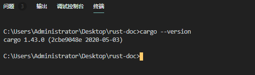
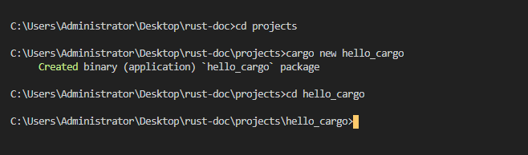
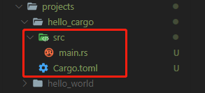
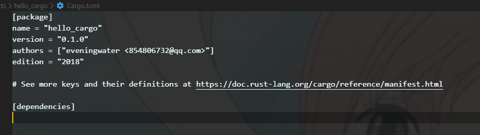
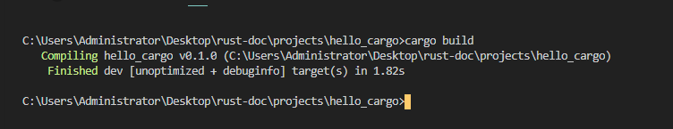
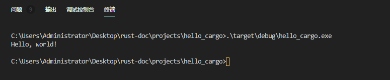
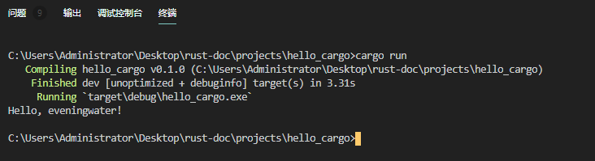
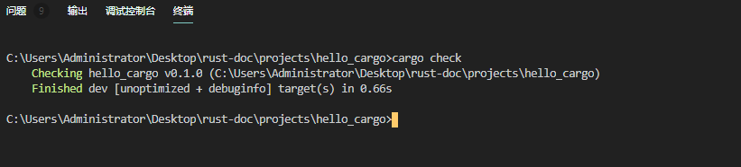

### 你好，cargo

Cargo是Rust的构建系统和包管理器。大多数Rust开发者使用此工具来管理他们的Rust项目，因为Cargo会为你处理很多任务，例如构建代码，下载代码所依赖的库以及构建这些库。（我们称库为你的代码需要依赖项。）

与我们到目前为止编写的程序一样，最简单的Rust程序没有任何依赖。因此，如果我们在Cargo项目中仅仅只是写了`hello,world!`，它将仅使用Cargo处理代码的部分。在编写更复杂的Rust程序时，你将添加依赖项，并且如果使用Cargo启动项目，则添加依赖项将变得更加容易。

由于绝大多数Rust项目都使用Cargo，因此本文档其余部分都假设你也在使用Cargo。如果你使用了[安装](/doc/install)一节中讨论的官方安装程序，则Cargo会和Rust一起被安装。如果你通过其他方式安装了Rust，请在终端中输入以下内容，检查是否已安装Cargo：

```rust
$ cargo --version
```

如下图所示:



如果看到版本号，就可以了！如果看到错误（例如`command not found`），请查看[其它安装方法](https://forge.rust-lang.org/infra/other-installation-methods.html)的文档，以确定如何安装Cargo。

### 使用Cargo来创建一个项目

让我们使用Cargo创建一个新项目，看看它与我们最初的`hello,world`项目有何不同。导航返回到你的项目目录（或你决定存储代码的任何位置）。然后，在任何操作系统的终端上，运行以下命令：

```rust
$ cargo new hello_cargo
$ cd hello_cargo
```
如下图所示:



如果你在你的`projects`目录当中看到了如下图所示的文件，那证明你已经使用cargo创建一个新项目。



第一行命令创建一个名为hello_cargo的新目录。我们已将项目命名为`hello_cargo`，而Cargo会在同名目录中创建其文件。进入`hello_cargo`目录并列出文件。你会看到Cargo为我们生成了两个文件和一个目录：一个`Cargo.toml`文件和一个包含`main.rs`文件的`src`目录。

它还已经初始化了一个新的Git存储库以及一个`.gitignore`文件。 如果你在现有Git存储库中运行，则不会生成Git文件；你可以通过使用`cargo new --vcs=git`来覆盖此行为。

>注意：Git是常见的版本控制系统。 你可以使用`--vcs`标志将cargo更改为使用其他版本控制系统或不使用任何版本控制系统。运行`cargo new --help`以查看可用选项。

在你选择的文本编辑器中打开Cargo.toml。它的里面的内容应类似于如下所示的代码。

文件名:cargo.toml
```rust
[package]
name = "hello_cargo"
version = "0.1.0"
authors = ["Your Name <you@example.com>"]
edition = "2018"

[dependencies]

```
如下图所示:



该文件采用[TOML](https://github.com/toml-lang/toml)（Tom’s Obvious, Minimal Language）格式，这是Cargo的配置格式。

第一行`[package]`是一行标题，指示以下语句正在配置程序包。当我们向该文件添加更多信息时，我们将添加到其它行中。

接下来的四行设置了Cargo编译程序所需的配置信息：名称，版本，编写者以及要使用的Rust版本。Cargo从你的环境中获取你的姓名和电子邮件信息，因此，如果该信息不正确，请立即修复该信息，然后保存文件，我们将在附录E中讨论版本密钥。

最后一行`[dependencies]`是本节的开头，你可以在其中列出项目的任何依赖项。在Rust中，代码包称为`crates(中文译为盒子或者箱子)`。该项目不需要任何其他`crates`，但是我们将在第2章的第一个项目中使用，因此我们将使用此依赖项部分。

现在打开`src/main.rs`看一看:

文件名:src/main.rs
```rust
fn main(){
    println!("hello,world!");
}
```

cargo为我们产生了一个`hello,world`程序，就像前面的`hello,world`示例中编写的那样！到目前为止，我们之前的项目与Cargo生成的项目之间的区别在于Cargo将代码放置在src目录中，以及在根目录中有一个Cargo.toml配置文件。

Cargo希望你的源文件位于src目录中。项目根目录仅用于README文件，许可证信息，配置文件以及与你的代码无关的其他任何内容。使用cargo可以帮助你组织项目。每个东西都有它的位置,而且每个东西就在它自己的位子上,也就是说项目文件需要整齐有序，井井有条。

如果你启动了一个不使用Cargo的项目，就像我们所创建的`hello,world`那样的项目，你可以将其转换为使用Cargo的项目。将项目代码移到src目录中，并创建一个适当的Cargo.toml文件。

### 构建和运行一个cargo项目

现在，让我们看看使用cargo构建和运行`hello,world!`的不同之处。在`hello_cargo`目录中，输入以下命令来构建项目：

```rust
$ cargo build
   Compiling hello_cargo v0.1.0 (file:///projects/hello_cargo)
    Finished dev [unoptimized + debuginfo] target(s) in 2.85 secs
```

如下图所示:



此命令在`target/debug/hello_cargo`（或Windows上的`target\debug\hello_cargo.exe`）中而不是当前目录中创建一个可执行文件。你可以使用以下命令运行可执行文件：

```rust
$ ./target/debug/hello_cargo # or .\target\debug\hello_cargo.exe on Windows
Hello, world!
```

如下图所示:



或者先`cd到exe文件下的根目录`，然后运行，如下图所示:


如果一切顺利，`hello,world!`应该打印到终端。首次运行cargo将会在`target`目录中创建一个新文件：Cargo.lock。此文件跟踪项目中依赖项的确切版本。该项目没有依赖项，因此文件有内容是空白的。你将不需要手动更改此文件,cargo会为你管理其内容。

我们只是使用`cargo build`构建了一个项目，并使用`./target/debug/hello_cargo`运行了该项目，但是我们也可以使用`cargo run`编译代码，然后在一个命令中全部运行生成的可执行文件：

```rust
$ cargo run
    Finished dev [unoptimized + debuginfo] target(s) in 0.0 secs
     Running `target/debug/hello_cargo`
Hello, world!
```

如下图所示：


请注意，这次我们没有看到表明`Cargo正在编译hello_cargo（Compiling hello_cargo v0.1.0 (file:///projects/hello_cargo)）`的输出。Cargo发现文件没有更改，因此只运行了二进制文件。如果你修改了源代码，则Cargo将在运行项目之前重建项目，并且你将看到以下输出：

```rust
$ cargo run
   Compiling hello_cargo v0.1.0 (file:///projects/hello_cargo)
    Finished dev [unoptimized + debuginfo] target(s) in 0.33 secs
     Running `target/debug/hello_cargo`
Hello, world! //一般都会修改这里的内容，所以这里的显示应该是不一样的
```

如下图所示:



cargo还提供一个称为`cargo check`的命令。此命令会快速检查你的代码，以确保其可编译但不会产生可执行文件：

```rust
$ cargo check
   Checking hello_cargo v0.1.0 (file:///projects/hello_cargo)
    Finished dev [unoptimized + debuginfo] target(s) in 0.32 secs
```

如下图所示:

