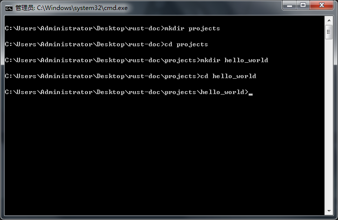
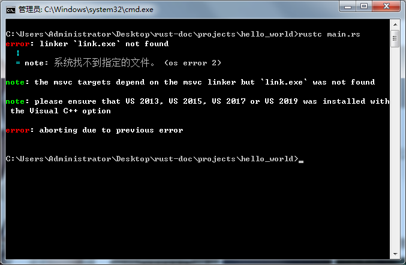
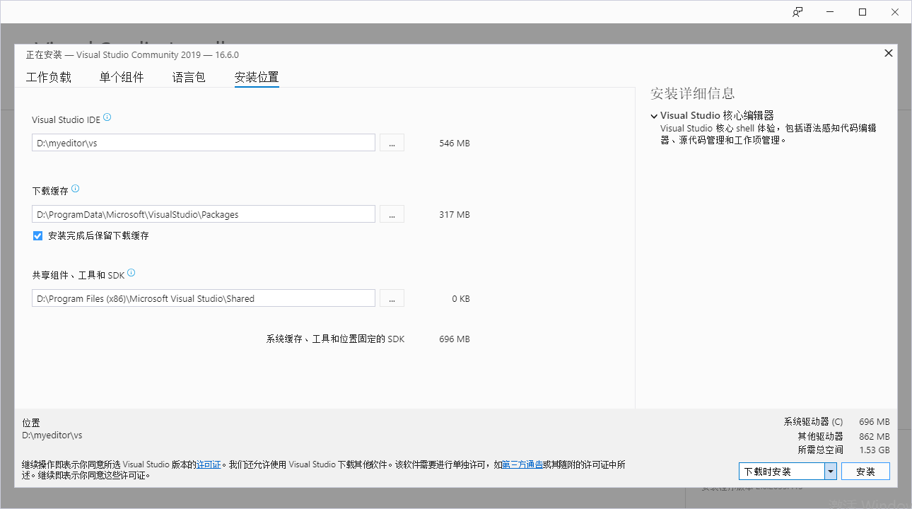
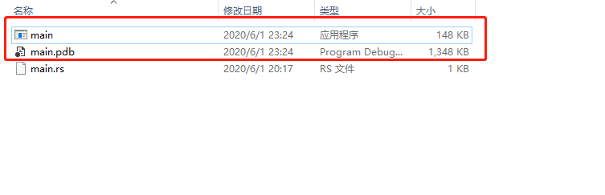
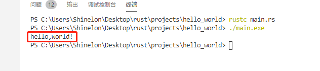
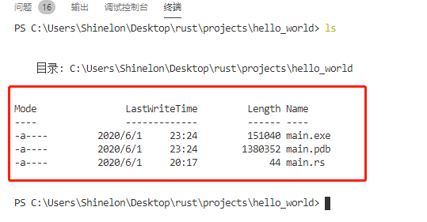
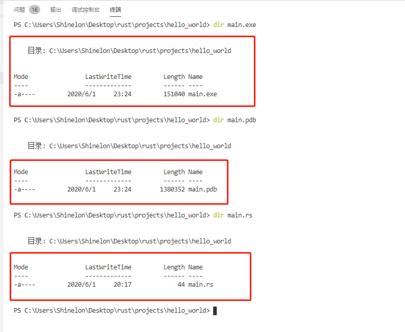
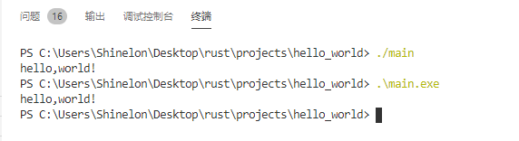

### hello,world

现在你已经安装了Rust，让我们编写第一个Rust程序。 在学习一种新语言时编写一个小的程序以打印文本“ Hello，world！”到屏幕上，是一种传统。所以我们在这里做同样的事情！

>注意：本书假定你基本熟悉命令行。Rust对你的编辑或工具或代码所在的位置没有特殊要求，因此，如果你更喜欢使用集成开发环境（IDE）而不是命令行，请随时使用自己喜欢的IDE。现在，许多IDE都提供了一定程度的Rust支持。有关详细信息，请查看IDE的文档。 最近，Rust团队一直致力于实现出色的IDE支持，并且在这方面已经取得了迅速的进步！

### 创建项目目录

首先，创建一个目录来存储你的Rust代码。 对于Rust来说，你的代码位于哪里并不重要，但是对于本文档中的练习和项目，我们建议在你的主目录中创建一个`projects`目录，并将所有项目保存在该目录中。

打开终端，输入以下命令以创建项目目录和在项目目录中的项目“ Hello，world！”目录。

对于Windows上的PowerShell，Linux和macOS，请输入以下命令：

```js
$ mkdir ~/projects
$ cd ~/projects
$ mkdir hello_world
$ cd hello_world
```
对于Windows CMD，请输入以下命令:

```js
> mkdir "%USERPROFILE%\projects"
> cd /d "%USERPROFILE%\projects"
> mkdir hello_world
> cd hello_world

```

如下图所示:



### 编写和运行一个Rust运行程序

接下来，创建一个新的源文件并将其命名为`main.rs`。Rust文件始终以`.rs`扩展名结尾。如果文件名中使用多个单词，请使用下划线将其分开。例如，使用`hello_world.rs`而不是`helloworld.rs`。

现在打开刚刚创建的`main.rs`文件，并第一行中输入代码。

文件名:main.rs:

```rust
  fn main(){
      println!("hello,world!");
  }
```

保存文件并返回到终端窗口。在Linux或macOS上，输入以下命令来编译和运行文件：

```rust
$ rustc main.rs
$ ./main
```
在windows上，输入命令`main.exe`代替`./main`：

```rust
> rustc main.rs
> .\main.exe
```
如果运行提示如下错误，则代表我们未安装Visual Studio 2019安装构建工具,前往[下载地址](https://www.visualstudio.com/downloads/#build-tools-for-visual-studio-2019)下载安装。



下载了`Visual Studio.exe`文件之后，注意在选择界面的时候选择`C++`构建工具，当然如果不觉得麻烦，可以一键所有都选择下载安装，一键傻瓜式的安装，无非需要注意的就是如果不想将该软件安装在`C盘`，可以在如下界面时切换安装路径，如我安装在`D盘`的`myeditor/vs`目录。



点击安装，然后耐心等待安装完成。

> 温馨提示：如果不会配置系统环境变量，最好不要将`vs`安装在其他盘，就默认安装在`C盘即可`，安装完成之后，再重新启动即可。本人后面研究了一番不会配置环境变量，所以也只好将`vs`安装在了`C盘`。

现在我们再次定位到`hello,world`目录，输入命令`rustc main.rs`,如果当前目录为我们生成了如下图所示的文件，就表示编译成功。



接下来我们只要输入`./main.exe`，我们可以在`vscode`终端中运行该命令，即可看到打印出`hello,world`的信息，如下图所示:



不管你的操作系统如何，字符串`Hello，world！`都应该打印到终端。如果看不到此输出，请参考[安装](/doc/install)部分的“故障排除”部分，以获取帮助。

如果`Hello，world！` 打印了，恭喜！ 你已经正式编写了Rust程序，这使你成为Rust程序员——欢迎你！

### 剖析Rust程序

让我们详细回顾一下`hello,world`程序中所发生的一切，这是第一个难题：

```rust
  fn main() {

  }
```

这些代码定义了一个Rust函数。`main`函数比较特殊：它始终是每个可执行Rust程序中运行的第一个代码。第一行声明了一个名为main的函数，该函数没有任何参数，也没有任何返回值。如果有参数，它们将放在括号`()`中。

另外，请注意，函数体用大括号`{}`括起来。 Rust的所有函数体中都需要`{}`。将开头的大括号放在函数声明的同一行上是很好的代码风格，然后在两者之间添加一个空格。

`main`函数里紧跟着的是如下一行代码:

```rust
println!("Hello, world!");
```

此行完成了此小程序中的所有工作：它将文本输出到屏幕上。这里有四个要注意的重要细节。首先，Rust风格是缩进四个空格，而不是`tab`制表符的空格。

第二，println! 调用Rust[宏](https://baike.baidu.com/item/macro/10429400?fr=aladdin)。如果改为调用函数，则将其输入为println（不带!）。我们将在第19章中更详细地讨论Rust宏。现在，你只需要知道使用!即可。表示你正在调用宏而不是普通函数。

第三，你看到的是`hello,world!`字符串。我们将此字符串作为参数传递给println!，然后将该字符串打印到屏幕上。

第四，我们用分号（;）结束该行，这表明该表达式已结束，下一个表达式可以开始了。Rust代码的大多数行以分号结尾。

### 编译和运行是单独的步骤

你刚刚运行了一个新创建的程序，因此让我们来理清一下该过程中的每个步骤。

在运行Rust程序之前，你必须使用Rust编译器通过输入`rustc`命令并向其传递源文件的名称来对其进行编译，如下所示：

```rust
$ rustc main.rs
```

如果你具有C或C++开发经验，则会注意到这类似于[gcc](https://baike.baidu.com/item/gcc/17570?fr=aladdin)或[clang](https://baike.baidu.com/item/clang/3698345?fr=aladdin)。 成功编译后，Rust输出二进制可执行文件(`.exe`)。

在Linux，macOS和Windows上的PowerShell中，你可以通过在Shell中输入`ls`命令来查看可执行文件。 在Linux和macOS上，你会看到两个文件。使用Windows上的PowerShell，你将看到与使用CMD时看到的相同的三个文件。

```text
$ ls
main  main.rs
```

在windows的CMD中，你可以输入如下的命令:

```rust
> dir /B %= the /B option says to only show the file names =%
main.exe
main.pdb
main.rs
```

这里的`/B`指的就是文件名，比如你想要查看`main.rs`，输入`dir main.rs`。如下图所示:




这显示了带有`.rs`扩展名的源代码文件，可执行文件（在Windows上是`main.exe`，在所有其他平台上是`main`），以及在使用Windows时，包含一个带有`.pdb`扩展名的调试信息的文件。在这里，运行`main`或`main.exe`文件，如下所示：

``` rust
$ ./main # or .\main.exe on Windows
```

如下图所示:



这意味着`./main`或者`./main.exe`命令都是可以正常运行的，相对而言，我比较倾向于前者（省略了后缀名）。如果main.rs是你的`hello,world`程序，此行将打印`hello,world!`到你的终端。

如果你对Ruby，Python或JavaScript等动态语言更加熟悉，则可能不习惯将它们作为单独的步骤来编译和运行程序。Rust是一种提前编译的语言，这意味着你可以编译程序并将可执行文件提供给其他人，即使他们没有安装Rust也可以运行它。如果给某人一个.rb，.py或.js文件，则他们需要分别安装Ruby，Python或JavaScript实现。但是在这些语言中，你只需要一个命令即可编译和运行程序。一切都需要在语言设计中进行权衡。

对于简单的程序，仅使用`rustc`进行编译就可以了，但是随着项目的发展，你将需要管理所有选项并使其易于共享代码。接下来，我们将向你介绍`Cargo`工具，它将帮助你编写真实的Rust程序。

