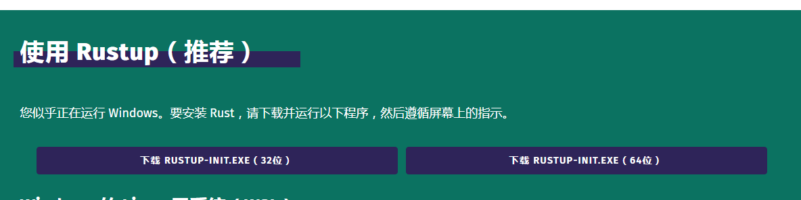
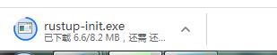
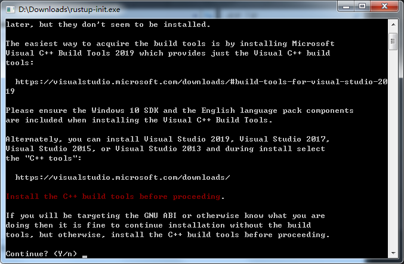
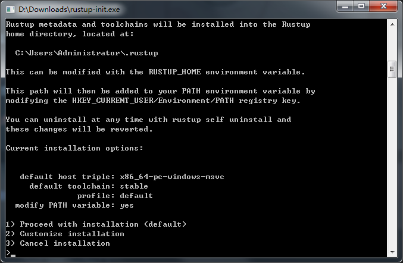
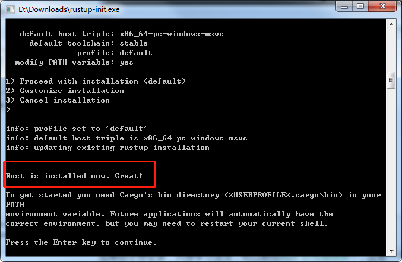
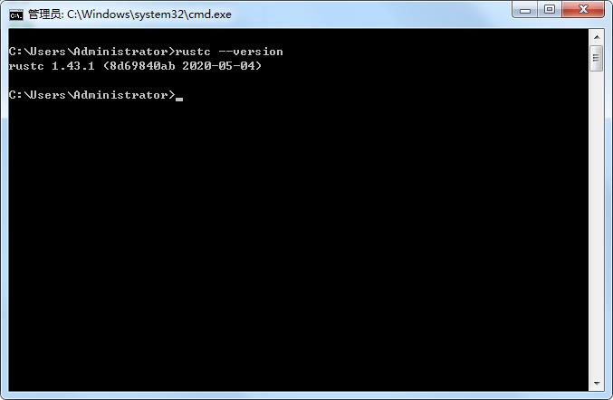

### 安装

第一步当然就是安装Rust。我们将通过rustup（一个用于管理Rust版本和相关工具的命令行工具）下载Rust。你需要互联网连接才能下载。

>注:如果由于某些原因你不想使用rustup，请参阅[Rust安装页面](https://www.rust-lang.org/tools/install)以获取其他选项。

以下步骤将安装Rust编译器的最新稳定版本。Rust的稳定性保证可确保本文档中所有可编译的示例都将继续使用较新的Rust版本进行编译。 不同版本之间的输出可能会略有不同，因为Rust经常会改进错误消息和警告。 换句话说，使用这些步骤安装的任何较新的稳定版本的Rust都应该可以按本文档的预期工作。

>命令行符号
在本章以及整个文档中，我们将展示一些在终端中使用的命令。你应在终端中输入的行均以$开头。你无需输入$字符，它指示每个命令的开始。不以$开头的行通常显示前一个命令的输出。此外，特定于PowerShell的示例将使用>而不是$。

#### 在Linux或macOS上安装rustup

如果你使用的是Linux或macOS，请打开一个终端并输入以下命令：

```rust
$ curl https://sh.rustup.rs -sSf | sh
```

该命令将下载一个脚本并开始安装rustup工具，该工具将安装Rust的最新稳定版本。可能会提示你输入密码。如果安装成功，将显示以下行：

```text
Rust is installed now. Great!
```

如果你愿意的话，请在运行脚本之前先下载脚本并进行检查。

下次登录后，安装脚本会自动将Rust添加到系统环境变量PATH中。如果要立即开始使用Rust，而不是重新启动终端，请在Shell中运行以下命令，以将Rust手动添加到系统环境变量PATH中：

```rust
$ source $HOME/.cargo/env
```

另外，你可以将以下行添加到`~/.bash_profile`中：

```rust
$ export PATH="$HOME/.cargo/bin:$PATH"
```

此外，你将需要某种链接程序。可能已经安装了一个链接程序，但是当你尝试编译Rust程序并收到错误消息，表明该链接程序无法执行时，意味着你的系统上尚未安装链接程序，你需要手动安装一个链接程序。 C编译器通常带有正确的链接程序。 查看平台的文档，了解如何安装C编译器。 另外，一些常见的Rust包依赖于C代码，并且需要C编译器。因此，可能值得立即安装一个。

#### 在windows上下载rustup

在Windows上，前往[rustup](https://www.rust-lang.org/tools/install)并按照说明安装Rust。在安装过程中的某个时刻，你会收到一条消息，说明你还需要安装Visual Studio 2013或更高版本的C++构建工具。获取该构建工具的最简单方法是安装[Visual Studio 2019安装构建工具](https://www.visualstudio.com/downloads/#build-tools-for-visual-studio-2019)。这些工具都集成在所安装的工具中。

本文档的其余可使用的命令均可在`cmd.exe`和`PowerShell`中使用，如果有特定差异，我们将说明使用哪个命令工具。

#### 更新与卸载

通过rustup安装Rust后，很容易更新到最新版本。在你的终端`PowerShell`中，运行以下更新脚本：

```rust
$ rustup update
```

要卸载Rust和rustup，请从你的`PowerShell`中运行以下卸载脚本：

```rust
$ rustup self uninstall
```

#### 故障排除

检查你的Rust是否正确安装，在你的`PowerShell`运行如下脚本：

```rust
$ rustc --version
```

你应该看到已发布的最新稳定版本的版本号，提交历史记录和提交日期，格式如下：

```text
rustc x.y.z (abcabcabc yyyy-mm-dd)
```

如果你看到此信息，则说明你已成功安装Rust！如果你没有看到此信息，并且你使用的是Windows，请检查Rust是否在`%PATH%`系统变量中。 如果一切正确，但Rust仍然无法正常工作，你可以在许多地方获得帮助。最简单的是[the official Rust Discord](https://discord.gg/rust-lang)中的`#beginners channel`。在这里，你可以与其他可以帮助你的`Rustaceans`（我们称为a silly nickname）聊天。 其它如[the Users forum](https://users.rust-lang.org/)论坛和[Stack Overflow](http://stackoverflow.com/questions/tagged/rust)。

#### 本地文件

Rust的安装还包括本地文档的副本，因此你可以离线阅读。运行`rustup doc`在浏览器中即可打开本地文档。每当标准库提供类型或函数时，如果你不确定它的用途或用法，请使用应用程序编程接口（API）文档进行查找！

#### 以下为本人安装过程

前往官方下载文档，我们可以看到如下图所示：



如果你的系统是32位则选择32位下载，否则选择64位下载。然后等待如下程序下载完成：



下载完成之后，在你的本地磁盘找到该`exe`程序双击并运行。如下图所示:



输入`Y`也就是`yes`进行下一步。



按`enter`继续下一步，如果有杀毒软件如360，金山毒霸之类的提示修改特殊系统启动项，请选择允许。然后这是一个漫长的安装过程，耐心等待吧！

当你看到如下图所示，就表示Rust安装成功。



输入命令`rustc --version`我们可以看到版本号，如下图所示:




### 在线编辑器

如果你不想安装，只想学习语法，可以前往[Rust 在线编辑器](https://play.rust-lang.org/)，这是一个在线运行代码的编辑器。