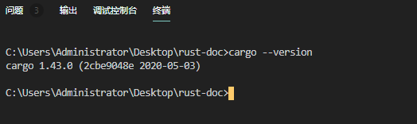
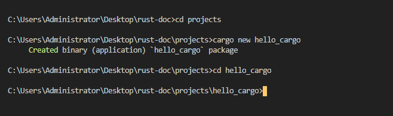
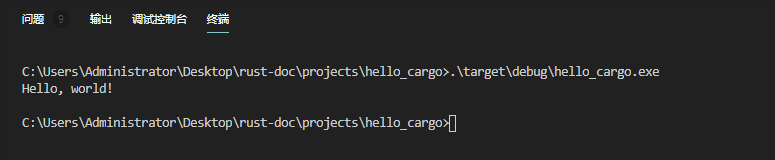
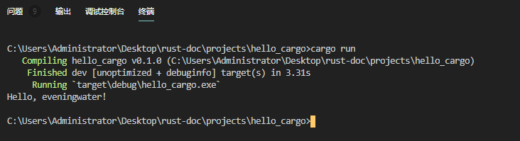
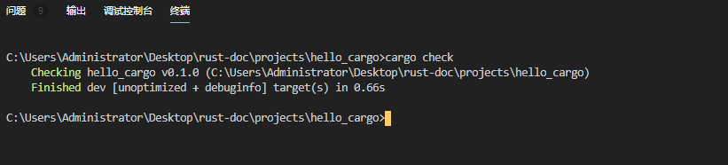

## 你好，cargo

Cargo 是 Rust 的构建系统和包管理器。大多数 Rust 开发者使用此工具来管理他们的 Rust 项目，因为 Cargo 会为你处理很多任务，例如构建代码，下载代码所依赖的库以及构建这些库。（我们称库为你的代码需要依赖项。）

与我们到目前为止编写的程序一样，最简单的 Rust 程序没有任何依赖。因此，如果我们在 Cargo 项目中仅仅只是写了`hello,world!`，它将仅使用 Cargo 处理代码的部分。在编写更复杂的 Rust 程序时，你将添加依赖项，并且如果使用 Cargo 启动项目，则添加依赖项将变得更加容易。

由于绝大多数 Rust 项目都使用 Cargo，因此本文档其余部分都假设你也在使用 Cargo。如果你使用了[安装](./install)一节中讨论的官方安装程序，则 Cargo 会和 Rust 一起被安装。如果你通过其他方式安装了 Rust，请在终端中输入以下内容，检查是否已安装 Cargo：

```rust
$ cargo --version
```

如下图所示:



如果看到版本号，就可以了！如果看到错误（例如`command not found`），请查看[其它安装方法](https://forge.rust-lang.org/infra/other-installation-methods.html)的文档，以确定如何安装 Cargo。

## 使用 Cargo 来创建一个项目

让我们使用 Cargo 创建一个新项目，看看它与我们最初的`hello,world`项目有何不同。导航返回到你的项目目录（或你决定存储代码的任何位置）。然后，在任何操作系统的终端上，运行以下命令：

```rust
$ cargo new hello_cargo
$ cd hello_cargo
```

如下图所示:



如果你在你的`projects`目录当中看到了如下图所示的文件，那证明你已经使用 cargo 创建一个新项目。


第一行命令创建一个名为 hello_cargo 的新目录。我们已将项目命名为`hello_cargo`，而 Cargo 会在同名目录中创建其文件。进入`hello_cargo`目录并列出文件。你会看到 Cargo 为我们生成了两个文件和一个目录：一个`Cargo.toml`文件和一个包含`main.rs`文件的`src`目录。

它还已经初始化了一个新的 Git 存储库以及一个`.gitignore`文件。 如果你在现有 Git 存储库中运行，则不会生成 Git 文件；你可以通过使用`cargo new --vcs=git`来覆盖此行为。

> 注意：Git 是常见的版本控制系统。 你可以使用`--vcs`标志将 cargo 更改为使用其他版本控制系统或不使用任何版本控制系统。运行`cargo new --help`以查看可用选项。

在你选择的文本编辑器中打开 Cargo.toml。它的里面的内容应类似于如下所示的代码。

文件名:cargo.toml

```rust
[package]
name = "hello_cargo"
version = "0.1.0"
authors = ["Your Name <you@example.com>"]
edition = "2018"

[dependencies]

```

如下图所示:


该文件采用[TOML](https://github.com/toml-lang/toml)（Tom’s Obvious, Minimal Language）格式，这是 Cargo 的配置格式。

第一行`[package]`是一行标题，指示以下语句正在配置程序包。当我们向该文件添加更多信息时，我们将添加到其它行中。

接下来的四行设置了 Cargo 编译程序所需的配置信息：名称，版本，编写者以及要使用的 Rust 版本。Cargo 从你的环境中获取你的姓名和电子邮件信息，因此，如果该信息不正确，请立即修复该信息，然后保存文件，我们将在[附录 E](../appendix/appendix-e.md) 中讨论版本密钥。

最后一行`[dependencies]`是本节的开头，你可以在其中列出项目的任何依赖项。在 Rust 中，代码包称为`crates(中文译为盒子或者箱子)`。该项目不需要任何其他`crates`，但是我们将在第 2 章的第一个项目中使用，因此我们将使用此依赖项部分。

现在打开`src/main.rs`看一看:

文件名:src/main.rs

```rust
fn main(){
    println!("hello,world!");
}
```

cargo 为我们产生了一个`hello,world`程序，就像前面的`hello,world`示例中编写的那样！到目前为止，我们之前的项目与 Cargo 生成的项目之间的区别在于 Cargo 将代码放置在 src 目录中，以及在根目录中有一个 Cargo.toml 配置文件。

Cargo 希望你的源文件位于 src 目录中。项目根目录仅用于 README 文件，许可证信息，配置文件以及与你的代码无关的其他任何内容。使用 cargo 可以帮助你组织项目。每个东西都有它的位置,而且每个东西就在它自己的位子上,也就是说项目文件需要整齐有序，井井有条。

如果你启动了一个不使用 Cargo 的项目，就像我们所创建的`hello,world`那样的项目，你可以将其转换为使用 Cargo 的项目。将项目代码移到 src 目录中，并创建一个适当的 Cargo.toml 文件。

## 构建和运行一个 cargo 项目

现在，让我们看看使用 cargo 构建和运行`hello,world!`的不同之处。在`hello_cargo`目录中，输入以下命令来构建项目：

```rust
$ cargo build
   Compiling hello_cargo v0.1.0 (file:///projects/hello_cargo)
    Finished dev [unoptimized + debuginfo] target(s) in 2.85 secs
```

如下图所示:


此命令在`target/debug/hello_cargo`（或 Windows 上的`target\debug\hello_cargo.exe`）中而不是当前目录中创建一个可执行文件。你可以使用以下命令运行可执行文件：

```rust
$ ./target/debug/hello_cargo # or .\target\debug\hello_cargo.exe on Windows
Hello, world!
```

如下图所示:



或者先`cd到exe文件下的根目录`，然后运行，如下图所示:


如果一切顺利，`hello,world!`应该打印到终端。首次运行 cargo 将会在`target`目录中创建一个新文件：Cargo.lock。此文件跟踪项目中依赖项的确切版本。该项目没有依赖项，因此文件有内容是空白的。你将不需要手动更改此文件,cargo 会为你管理其内容。

我们只是使用`cargo build`构建了一个项目，并使用`./target/debug/hello_cargo`运行了该项目，但是我们也可以使用`cargo run`编译代码，然后在一个命令中全部运行生成的可执行文件：

```rust
$ cargo run
    Finished dev [unoptimized + debuginfo] target(s) in 0.0 secs
     Running `target/debug/hello_cargo`
Hello, world!
```

如下图所示：


请注意，这次我们没有看到表明`Cargo正在编译hello_cargo（Compiling hello_cargo v0.1.0 (file:///projects/hello_cargo)）`的输出。Cargo 发现文件没有更改，因此只运行了二进制文件。如果你修改了源代码，则 Cargo 将在运行项目之前重建项目，并且你将看到以下输出：

```rust
$ cargo run
   Compiling hello_cargo v0.1.0 (file:///projects/hello_cargo)
    Finished dev [unoptimized + debuginfo] target(s) in 0.33 secs
     Running `target/debug/hello_cargo`
Hello, world! //一般都会修改这里的内容，所以这里的显示应该是不一样的
```

如下图所示:



cargo 还提供一个称为`cargo check`的命令。此命令会快速检查你的代码，以确保其可编译但不会产生可执行文件：

```rust
$ cargo check
   Checking hello_cargo v0.1.0 (file:///projects/hello_cargo)
    Finished dev [unoptimized + debuginfo] target(s) in 0.32 secs
```

如下图所示:



为什么不想要可执行文件？通常，`cargo check`比`cargo build`要快得多，因为它跳过了生成可执行文件的步骤。如果你在编写代码时不断检查代码是否运行，那么使用`cargo check`将加快流程！因此，许多 Rust 爱好者在编写程序以确保编译时会定期使用`cargo check`命令进行检查。然后，当他们准备使用可执行文件时，他们使用`cargo build`命令。

让我们回顾一下到目前为止我们对`cargo`的了解：

- 我们可以使用`cargo build`来构建项目或者使用`cargo check`来检查代码。
- 我们可以使用`cargo run`命令来构建和运行项目。
- Cargo 并未将构建结果与我们的代码保存在同一目录中，而是将其存储在`target/debug`目录中。

使用 Cargo 的另一个好处是，无论你使用哪种操作系统，命令都相同。因此，在这一点上，我们将不再针对 Linux 和 macOS 与 Windows 提供具体说明。

## 构建与发布

当项目最终准备好发布时，可以使用`cargo build --release`进行优化编译。此命令将在`target/release`中创建一个可执行文件，而不是在`target/debug`中。这些优化使你的 Rust 代码运行得更快，但是启用它们会延长程序编译的时间。这就是为什么要使用两种不同的配置文件的原因：一种用于开发，当你想要快速且经常地进行重建时，另一种用于构建最终程序，你将提供给用户不会重复重建且运行速度尽可能的快的程序。如果你要对代码的运行时间进行基准测试，请务必运行`cargo build --release`命令来构建在`target/release`中的可执行文件。

## cargo 使用规范

对于简单的项目，Cargo 并没有太大的意义，仅仅使用`rustc`即可，但随着你的程序变得更加复杂，它的意义就体现出来了。对于由多个`crates`组成的复杂项目，让 Cargo 协调构建过程要容易得多。

尽管`hello_cargo`项目很简单，但现在它会使用你在 Rust 其余部分中将使用的许多实际工具。实际上，要处理任何现有项目，你可以使用以下命令来通过 git 管理代码，更改为该项目的目录并进行构建：

```shell
$ git clone + 项目git地址
$ cd 项目名
$ cargo build
```

关于 cargo 的更多信息，可以参阅[文档](https://doc.rust-lang.org/cargo/)。

## 摘要

你已经开始了 Rust 之旅的美好开端！ 在本章中，你学习了如何：

- 使用 rustup 安装最新稳定版本的 Rust
- 更新 Rust 版本
- 打开本地安装的文档
- 编写`hello,world!`程序,并能正确使用`rustc`命令运行
- 使用 cargo 创建和运行并规范新项目

这是构建更强大的程序以习惯于阅读和编写 Rust 代码的好时机。因此，在第二章中，我们将构建一个猜测游戏程序。如果你想开始学习 Rust 中常见的编程概念的工作原理，请参阅第 3 章，然后返回第 2 章。
